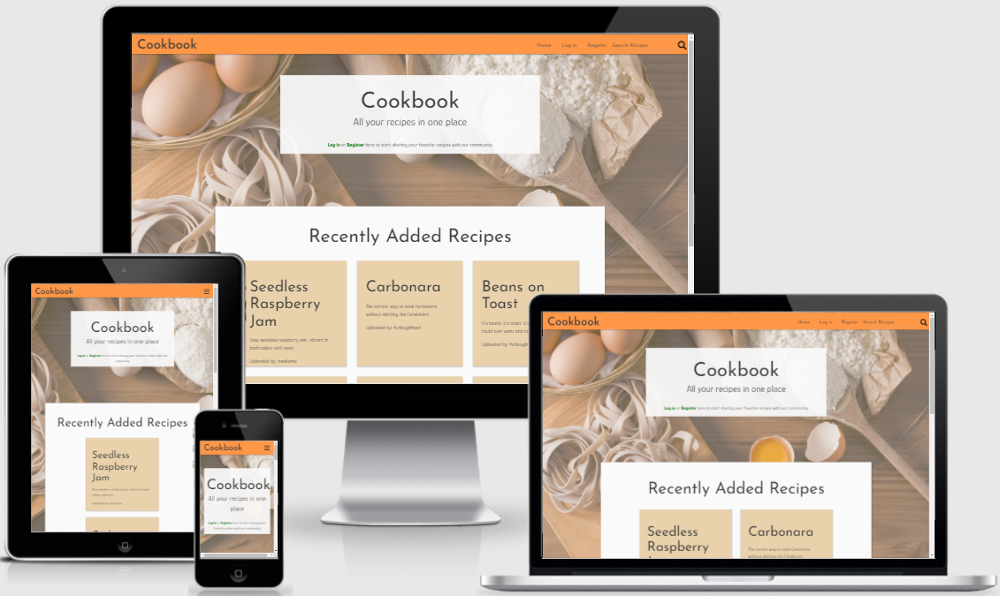
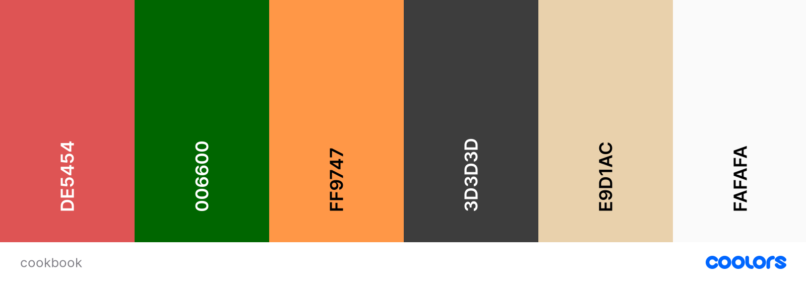
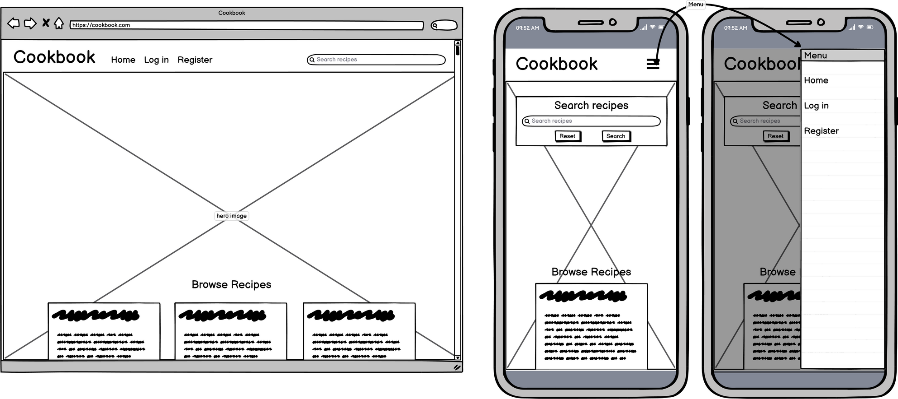
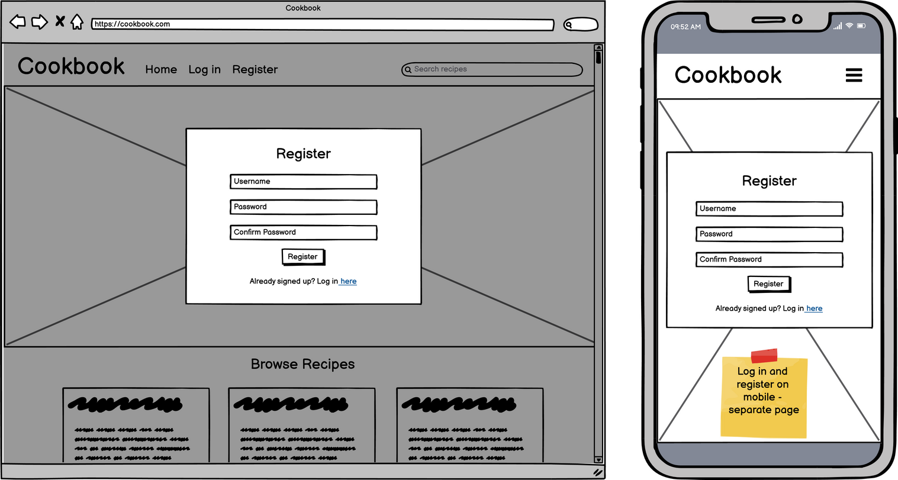
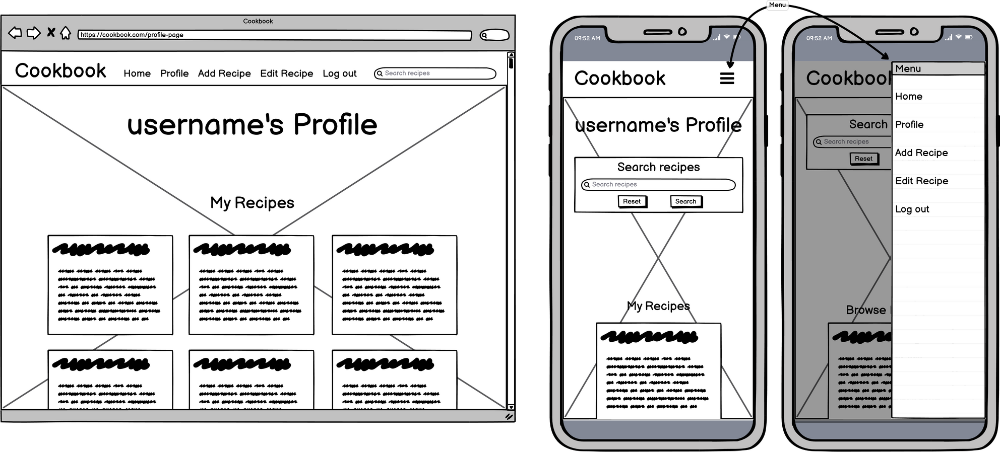
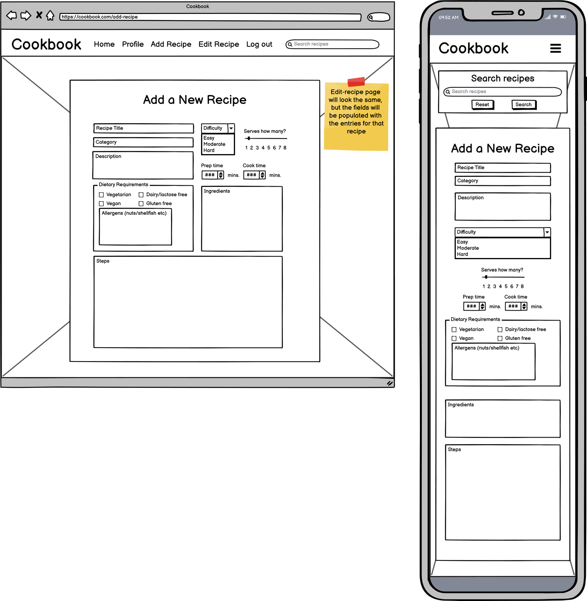
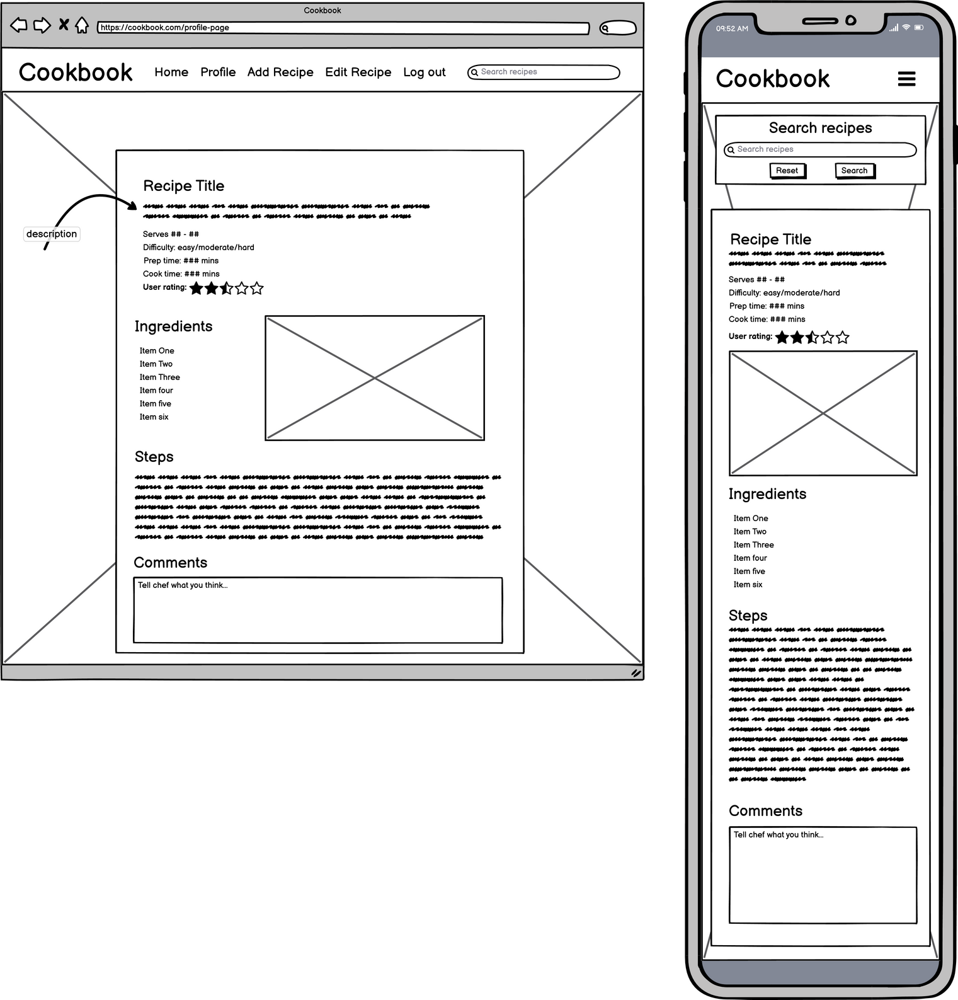
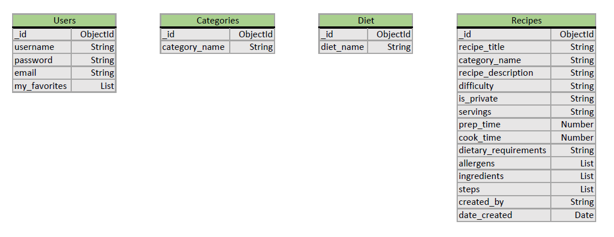

# Cookbook

Cookbook is an application designed to allow users to store their favourite food recipes and share them with other users. This project is the third milestone project as part of the Code Institute Diploma course. The deployed site can be viewed [here](http://tealhorizon-cookbook.herokuapp.com/)

## Table of Contents
1. [UX](#ux)
    - [User Stories](#user-stories)
    - [Design](#design)
    - [Wireframes](#wireframes)
2. [Features](#features)
3. [Technologies Used](#technologies-used)
4. [Testing](#testing)
5. [Deployment](#deployment)
6. [Credits](#credits)
    - [Content](#content)
    - [Acknowledgements](#acknowledgements)

## UX
This is a flask/Python web application, using MongoDB to store the backend data. The design is inspired from the myriad examples of online recipe guides already online, but few allow the user to upload their own recipes and share them with the greater online community.

### User Stories
User stories regarding the application in general:
  - As a new user, I want -
    - to easily understand the purpose of the site without further navigation
    - to be able to search the site without having to create an account
    - (if I decide to register) to have a personal page where my own entries will be clearly displayed

  - As a returning user, I want to be able to -
    - search for recipes by name, category, or ingredient
    - add a new recipe to the application with a simple form
    - edit my own recipes when necessary
    - keep my recipe private if I don't want others to see it
    - comment on other people's recipes to provide useful feedback of how it works

User stories regarding the recipes themselves:
  - As a user, I want -
    - to be able to see information about cooking times, difficulty and user rating
    - to see the ingredients listed in a clear way
    - to see if the recipe fulfils my dietary needs
    - clear and concise steps to complete the recipe

As the application owner, I want -
  - to encourage people to sign up for an account to allow for better owner/user interaction
  - to have the opportunity to promote cookware or other applications relevant to the section the user is viewing

### Design
This application is web-based, utilising several HTML templates to create, display, edit and delete recipes from the database. The home screen is useable by everyone, but certain functions such as adding new recipes and commenting on other users' recipes are restricted to registered users.
The recipes themselves are displayed such that information about the recipe is at the top, followed by ingredients and equipment, then cooking instructions. A comments box is below each recipe (for registered users) to allow users to interact with the recipe author.

The font families used for the application are Josefin Sans for all headings, Glory for main body text, and [font name] for decorative text. All fonts have been sourced from [Google Fonts](https://fonts.google.com/).

The colour scheme for the site has been taken from several of the photos used as backgrounds for the site. The colours are indicative of rustic cuisine, and should enhance the users' experience of the site. The palette was generated by [coolors](https://coolors.co/) and are as follows:

### Wireframes
Below are the wireframes used to design the layout. They were created using [Balsamiq](https://balsamiq.com/)
#### Home

#### Log in screen

#### Register screen

#### Profile

#### Add Recipe

#### Recipe

Back to [Table of Contents](#table-of-contents)

### Database
Below is a tabulated representation of the database schema that is used in this application. The 'Categories' and 'Diet' collections are predominantly used to populate sections of the recipe input form.

## Features
- A navbar - contiguous on all pages - that allows the user to access the areas of the application that they are authorised to access
- A search bar on the home page to allow users to search for recipes by keyword, name, category, or ingredients
- Login and registration pages to allow new users to register, and existing users to login
- A simple entry form to allow users to add new recipes to the database
- Edit and delete buttons on owned recipes to allow the owner to adjust or remove their own content
- A comment box below the recipe to allow users to interact with the community and author

### Future Features
- Give the user the chance to add an image to their recipe page
- Add a 5-star (or similar) rating system to allow users to rate other user's recipes
- Add a comments section to the bottom of the recipe card to allow users to provide relative feedback to the author of the recipe
- Add a profile dropdown on the menu and include the ability to remove one's account and to contact the application's owner

## Technologies Used
### Languages:
  - [HTML5](https://en.wikipedia.org/wiki/HTML5)
    - This is the main mark-up language for the project
  - [CSS3](https://en.wikipedia.org/wiki/CSS)
    - Used for personalised styling over and above the Materialize styles
  - [JavaScript](https://en.wikipedia.org/wiki/JavaScript)
    - Used to animate and control aspects of the pages that move
  - [Python](https://www.python.org/)
    - Used to connect the frontend application to the backend database, and to control the navigation and publication of the application
  - [Jinja](https://jinja.palletsprojects.com/en/3.0.x/)
    - A templating language/engine used to simplify the page layouts and insert data from the database

### Libraries and Frameworks:
  - [Google Fonts](https://fonts.google.com/)
    - Used as the source for the font databases used in this site
  - [Font Awesome 5.15.3](https://fontawesome.com/)
    - Used as the source for the icons used
  - [Materialize](https://materializecss.com/)
    - The main CSS library used to style the pages and make it responsive
  - [Flask](https://flask.palletsprojects.com/en/2.0.x/)
    - A microframework used to provide the tools and libraries used to create the application
  - [Werkzeug](https://werkzeug.palletsprojects.com/en/2.0.x/)
    - A web-app library used to add security to user passwords

### Tools:
  - [Atom](https://atom.io/) with [GitHub Desktop](https://desktop.github.com/)
    - Atom is my preferred text editor, linked with GitHub Desktop in order to push the code to GitHub
  - [Git](https://git-scm.com/)
    - Used for version control
  - [GitHub](https://github.com/)
    - Used to store the project files
  - [Balsamiq](https://balsamiq.com/)
    - A wireframe program used to create the mock-ups
  - [Coolors](https://coolors.co/)
    - An online tool to create colour palettes

Back to [Table of Contents](#table-of-contents)

## Testing

I have gathered all my testing data, and stored it in a separate file, which can be found [here](TESTING.md)

### Known Bugs
#### Input Validation
  The system by which the line under the input field changes colour dependant on whether the input is valid or not does not currently work for the `select` elements. This is a known fault with materialize CSS.

## Deployment
### Heroku
Deployment for this project is via [Heroku](https://www.heroku.com).
1. Create a requirements.txt file by typing pip3 freeze --local > requirements.txt in your repository terminal
2. Create a Procfile so that Heroku knows how to run the app. Do this by typing echo web: python app.py into your repositories terminal
3. Make sure these files have been pushed to the GitHub repository and then navigate to [Heroku](https://www.heroku.com)
4. Log in and select 'new' in the top right, name your app and choose a region that is closest to you. The app name must be unique.
5. On the dashboard for your app, select the 'Deploy' tab and under deployment method, select GitHub (the easiest option if your repository is in GitHub)
6. Enter the repository name underneath that and hit search. select the repository by clicking 'Connect'
7. You can either select Automatic or Manual deployment depending on your method. This project has been deployed with the manual method. Remember that if you choose manual, then every time the main/master branch is changed, you will need to re-deploy the app.
8. Next, go to the 'Settings' tab and select 'Reveal Config Vars'
9. Here you need to add several KEY: VALUE pairs for the app to run. They are
  - I.P: 0.0.0.0
  - PORT: 5000
  - MONGO_DBNAME: *database name*
  - MONGO_URI: *MongoDB URI, taken from the connections section of the database*
  - SECRET_KEY: *secret key of your choice*
10. Once these KEY: VALUE pairs have been added, the app will be reachable from the [Heroku](https://www.heroku.com) portal

### Forking the Repository
If you would like to view/change the code for the project then you can copy this repository to your GitHub account by forking it. You will then be able to do this without affecting the original repository:
1. From the repository home page,  click the 'fork' button (just below your picture with the dropdown menu)
2. You should now have a copy of the repository on your account

### Making a Local Clone
1. From the repository home page, select the 'code' tab (next to the green 'Gitpod' button)
2. To clone the repository using HTTPS, under "Clone with HTTPS", copy the link.
3. Open Git Bash
4. Change the current working directory to the location where you want the cloned directory to be made.
5. Type 'git clone', and then paste the URL you copied in Step 2.
6. Press Enter. Your local clone will be created.
7. Alternatively, you can use 'Open with GitHub Desktop' and follow the instructions, or just download the ZIP file containing the code files

Click [Here](https://docs.github.com/en/github/creating-cloning-and-archiving-repositories/cloning-a-repository-from-github/cloning-a-repository#cloning-a-repository-to-github-desktop) to view the GitHub documentation on deployment, or [Here](https://devcenter.heroku.com/)for the Heroku documentation for further help and advice.

Back to [Table of Contents](#table-of-contents)

## Credits

### Content
  - All code was written by myself or taken from the materialize documentation (with one exception; see below), with inspiration taken from the Code Institute walkthrough projects
  - The code to 'animate' the flash messages came from [Stack Overflow](https://stackoverflow.com/questions/21993661/css-auto-hide-elements-after-5-seconds/21994053#21994053)

### Acknowledgements
  - Thanks to my mentor for help, guidance and support during this project as always
  - [CSS-Tricks](https://css-tricks.com/) - a useful place to find CSS methods
  - [Stack Overflow](https://stackoverflow.com/) - much like w3schools, an essential source of guidance...there is always someone who has had the same problem, and the answer is likely here
  - [Code Institute](https://codeinstitute.net/) - from inspiration through all the walkthrough projects to the tools needed to complete

Back to [Table of Contents](#table-of-contents)
