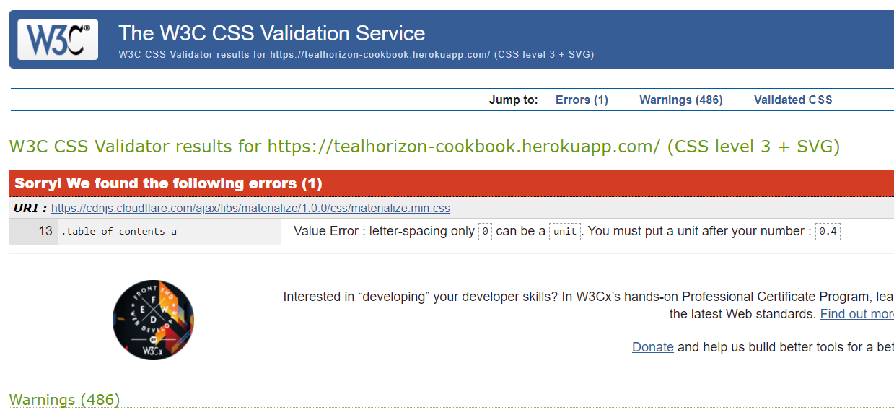
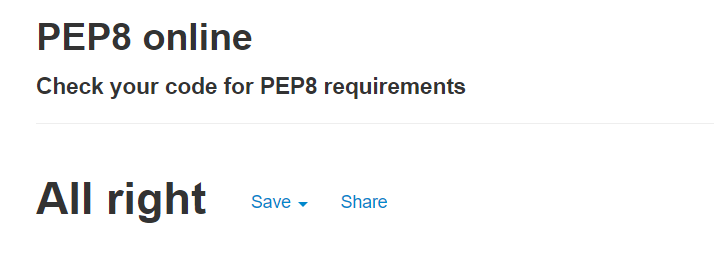
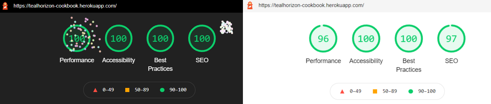
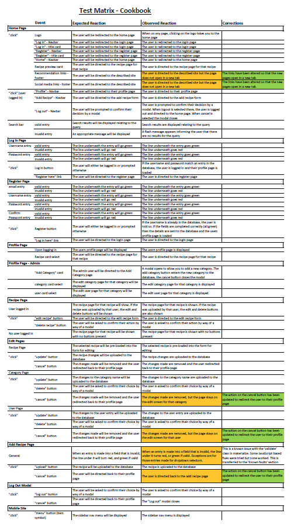

# Testing

This page contains all the stages that I went through to test this application and it's features.

You can return to the main README page [here](README.md)
## Table of Contents
1. [Code Validation](#code-validation)
    - [HTML](#html)
    - [CSS](#css)
    - [JavaScript](#javascript)
    - [Python](#python)
2. [Responsiveness](#responsiveness)
3. [Performance](#performance)
4. [Objective Testing](#objective-testing)
5. [User Story Evaluation](#user-story-evaluation)

## Code Validation

### HTML
The HTML code was passed through the [W3C Markup Validation Service](https://validator.w3.org/). After the initial inspection, it was realised tat only the base template was tested. This was later corrected and all templates were tested. The results found 2 main areas for errors
  - The `textarea` input fields were given a `pattern` attribute. This has now been removed as this element does not support that attribute.
  - A closing `
` tag was missing from several of the modals. This has now been corrected.

All corrections were added in commit [#89fb2da](https://github.com/tealhorizon87/ms3_cookbook/commit/89fb2da773b669901c5b930ad0ade78ffb9483cb). Any errors that remain are due to the sections of [Jinja](https://jinja.palletsprojects.com/en/3.0.x/) language that would, of course, not be able to pass through an HTML validator.

### CSS
The CSS file was passed through the [W3C CSS Validation Service](https://jigsaw.w3.org/css-validator/). The file passed with one error and several warnings. All were regarding the Materialize CSS files and not the custom stylesheet.

### JavaScript
The JavaScript file was copied into [JSLint](https://www.jslint.com/) for error checking. No errors were found.

### Python
The python code was copied into [PEP8 online](http://pep8online.com/) for error checking. The errors found were minor and related to spacing around operators and indentation surrounding continuation lines. This was subsequently corrected and re-tested:

The corrections were added in commit [#ea37314](https://github.com/tealhorizon87/ms3_cookbook/commit/ea37314e57a854f56f364f1e0055180723cc2ab8)

## Responsiveness

This application was built using [Materialize](https://materializecss.com/) and as such, responsiveness was inherent within the design. All pages are displayed correctly on all screen sizes without compromising the content of the page.

## Performance

### Lighthouse
Lighthouse was used to assess the performance of the page. This was done for both desktop and mobile versions; the reports are shown here (desktop/mobile):

These report were generated after some minor fixes that were added in commits [#81faac3](https://github.com/tealhorizon87/ms3_cookbook/commit/81faac3e04d26d7567ce009f9446c98523ea259d) and [#a4aa18f](https://github.com/tealhorizon87/ms3_cookbook/commit/a4aa18fd3efe18446909b200687076f5f16de37d). The fixes required were to re-sequence the heading elements and adding titles to image-based buttons to allow screen readers to discern their function.

### Cross-Browser Compatibility
The link for the site was uploaded to [BrowserStack](https://www.browserstack.com/). The site was then loaded using multiple browsers, and all worked exactly as expected.

Back to [Table of Contents](#table-of-contents)

## Objective Testing

Below is a preview of the table containing the testing matrix that was used to make sure all the functions in the project work correctly:

The full table can be found [here](static/docs/test-matrix.pdf). The corrections that were made are contained within commit [#dfc69d2](https://github.com/tealhorizon87/ms3_cookbook/commit/dfc69d2e94e0db620ffdb2f38c6378cb03c55fc9).

Back to [Table of Contents](#table-of-contents)

## User Story Evaluation

Finally, to make sure that the goals set out at the beginning of the project have been met, the user stories were evaluated:

User stories regarding the application in general:
  - As a new user, I want -
    - to easily understand the purpose of the site without further navigation
      - __a title and catch-line are present on the landing page__
    - to be able to search the site without having to create an account
      - __the search bar is available on the navbar for all users__
    - (if I decide to register) to have a personal page where my own entries will be clearly displayed
      - __every user has a profile page that will display their recipes and also their selected favourites__

  - As a returning user, I want to be able to -
    - search for recipes by name, category, or ingredient
      - __the search bar allows a text based search relating to most sections of the recipe__
    - add a new recipe to the application with a simple form
      - __the 'add recipe' page is a simple enough form, with sufficient guidance to the user as to how to fill it out__
    - edit my own recipes when necessary
      - __an edit button is on the recipe page for recipes that were originally written by the user__
    - keep my recipe private if I don't want others to see it
      - __a privacy switch is in the 'add recipe' form that will mask it from appearing on any page other than that user's profile page__
    - comment on other people's recipes to provide useful feedback of how it works
      - __due to time constraints, this feature has been added to the 'Future Features' list and will be added in due course__

User stories regarding the recipes themselves:
  - As a user, I want -
    - to be able to see information about cooking times, difficulty and user rating
      - __this information is available just beneath the recipe description__
    - to see the ingredients listed in a clear way
      - __the ingredients are added in CSV format (using *), and then split into a list so as to be displayed as an unordered list on the recipe page__
    - to see if the recipe fulfils my dietary needs
      - __a dietary requirements section is present, showing whether the recipe follows any particular food intolerance or specific diet__
    - clear and concise steps to complete the recipe
      - __steps are added similar to ingredients. The steps are as concise as the user inputs them; no control is made by the application owner on this section__

As the application owner, I want -
  - to encourage people to sign up for an account to allow for better owner/user interaction
    - __certain features such as adding a new recipe is only allowed if one is a registered user. Ample opportunity is given to the user to register for an account__
  - to have the opportunity to promote cookware or other applications relevant to the section the user is viewing
    - __a section in the footer contains links to external cookware sites as recommended by users__

Back to [Table of Contents](#table-of-contents)
